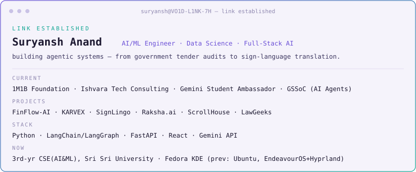

<picture>
  <source media="(prefers-color-scheme: dark)" srcset="vo1d-dark-term.svg">
  <source media="(prefers-color-scheme: light)" srcset="vo1d-light-term.svg">
  
</picture>

toggle GitHub's theme (Settings → Appearance) to see the other side · <a href="https://github.com/anand-esc">@anand-esc</a>

